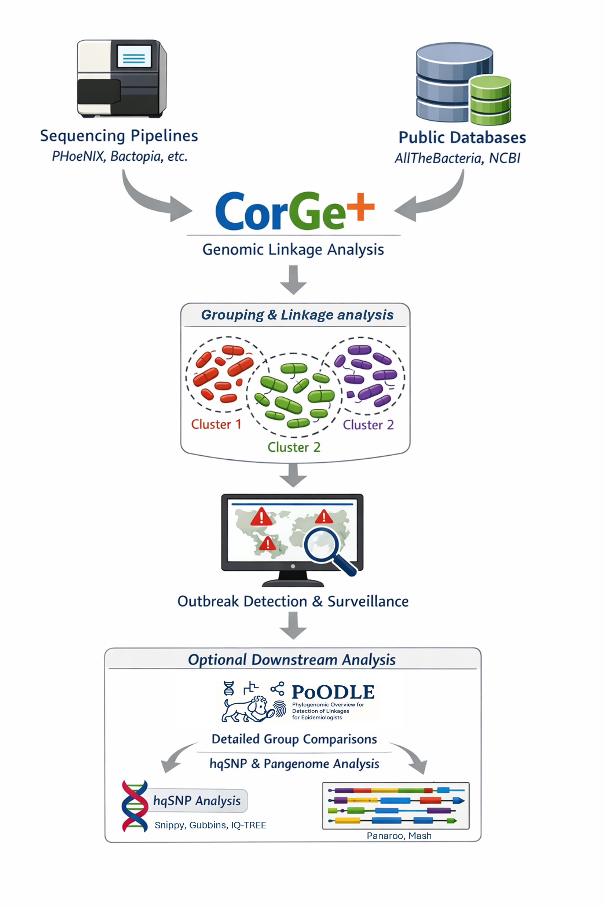
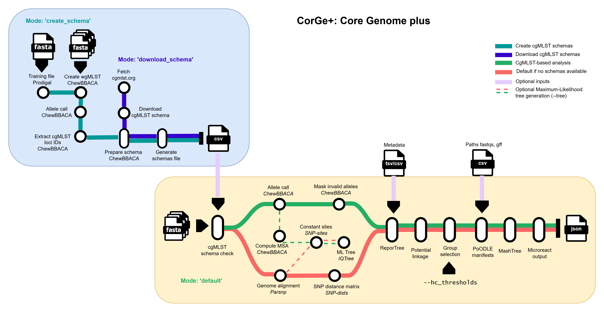

<p align="center">

</p>

# 🧬 CorGe+: Core Genome plus

[](https://www.nextflow.io/)
[](https://www.docker.com/)
[](https://sylabs.io/docs/)
[](https://apptainer.org/docs/user/latest/)
[](LICENSE)
[](https://github.com/MDHHS-Bioinformatics/mdhhs_repo_template/releases)


[](https://zenodo.org/badge/latestdoi/XXXXXX)


**CorGe+** (“_core-gee_”) is a bioinformatics pipeline for analyzing bacterial genomes, built to quickly determine genomic linkages and to group related isolates. By combining core genome MLST (cgMLST) and core genome alignment approaches, it provides a scalable way to triage datasets before deeper analysis, making it especially useful for genomic surveillance and outbreak investigations. From a simple sample sheet of FASTA files, CorGe+ produces linkage tables, Microreact-ready visualizations, metadata summaries, and distance-based cluster assignments.

### Suggested workflow

Genome assemblies from sequencing pipelines (e.g., [`PHoeNIx`](https://github.com/CDCgov/phoenix), [`Bactopia`](https://github.com/bactopia/bactopia), [`TheiaProk`](https://public-health-bacterial-genomics-theiagen.readthedocs.io/en/latest/theiaprok.html), or custom workflows) or public databases (e.g., [`AllTheBacteria`](https://github.com/AllTheBacteria/AllTheBacteria), [`NCBI`](https://www.ncbi.nlm.nih.gov/datasets/genome/)) can be analyzed with CorGe+ to identify potential linkages and group genetically similar samples. These groupings support more granular analyses for detecting related cases in routine surveillance and outbreak investigations.

Optional downstream analysis with [`PoODLE`](https://github.com/MDHHS-Bioinformatics/poodle) enables higher-resolution comparisons within each group, including SNP-based and pangenome analyses.

<p align="center">

</p>


## 🌟 Highlights

* 🧬 **Fast & scalable**: Built for high-throughput screening of large genomic datasets
* 🧪 **Multi-species support**: Analyzes multiple species in a single run
* 🔗 **Linkage detection & grouping**: Identifies related samples (alleles or SNPs) and groups them using flexible hierarchical-clustering (HC) thresholds
* 📊 **Actionable outputs**: Generates CSV reports, Microreact visualizations, and [`PoODLE`](https://github.com/MDHHS-Bioinformatics/poodle)-ready sample sheets
* 🗂️ **Persistent surveillance database**: Automatically compares new samples to historical data. Group nomenclature is preserved when using cgMLST
* 🕒 **Metadata-driven insights**: Uses [`ReporTree`](https://github.com/insapathogenomics/ReporTree) to summarize genetic clusters across metadata fields (e.g., time, location, clinical data) for enhanced epidemiological interpretation
* ⚙️ **Flexible workflows**: Supports regrouping, phylogenetic tree generation from prior results, and selective sample removal from the database


## 📊 Workflow Overview

### 

High-level steps for the `default` mode:

1. Verify cgMLST schema availability for each species.
2. Perform core genome analysis using [`ChewBBACA`](https://github.com/B-UMMI/chewBBACA) (cgMLST) or [`Parsnp`](https://github.com/marbl/parsnp) (core alignment if schema unavailable).
3. Generate a phylogenetic tree with [`IQ-TREE`](https://github.com/iqtree/iqtree2) (optional with `--tree`).
4. Hierarchical clustering with [`ReporTree`](https://github.com/insapathogenomics/ReporTree).
5. Create potential linkage tables per species.
6. Select groups per sample using user-defined HC thresholds.
7. Generate [`PoODLE`](https://github.com/MDHHS-Bioinformatics/poodle) manifests.
8. Run [`MashTree`](https://github.com/lskatz/mashtree).
9. Generate [`Microreact`](https://microreact.org/) files for visual exploration of genomic groups in trees.

Full workflow details: [`Worflow documentation`](docs/workflow.md)

## 🚀 Usage

### 1️⃣ Requirements

* [`Nextflow`](https://docs.seqera.io/nextflow/install) (`>=22.10.1`)
* One container runtime:
  * [`Docker`](https://docs.docker.com/engine/installation/) (recommended for local runs)
  * [`Singularity`](https://www.sylabs.io/guides/3.0/user-guide/)
  * [`Apptainer`](https://apptainer.org/docs/user/latest/) (recommended for HPC)


### 2️⃣ Get cgMLST schemas (optional, recommended)
CorGe+ can help you either download cgMLST schemas from [`cgmlst.org`](https://cgmlst.org/) or create cgMLST schemas with [`ChewBBACA`](https://github.com/B-UMMI/chewBBACA).

> Providing cgMLST schemas enables downstream cgMLST analysis. If no schemas are provided, samples will instead be analyzed with Parsnp. Compared to cgMLST, SNP-based analysis may yield less reproducible results because they depend on assembly quality and on a core genome that changes with dataset composition. Therefore, historical group nomenclature is preserved for cgMLST analyses only, not for SNP/Parsnp analyses.

#### Download cgMLST schemas
CorGe+ can automatically download and prepare cgMLST schemas from [`cgmlst.org`](https://cgmlst.org/). Schemas only need to be downloaded once per species.

Find available schema IDs in [`cgMLST schema IDs`](assets/cgmlst_schemas_id.csv) and supported species in [`cgMLST species`](assets/species_schemas.csv) (e.g., *A. baumannii* = `s1`, *E. coli* = `s20`). Multiple IDs can be listed as: `--schema_ids s1,s20`

```bash
nextflow run MDHHS-Bioinformatics/corge \
  --mode download_schema \
  --schema_ids s1,s20 \
  --outdir corge_results \
  -profile apptainer
```

#### Create cgMLST schemas

If a cgMLST schema for your species is not available from [`cgmlst.org`](https://cgmlst.org/), CorGe+ can help create a species-specific cgMLST schema using [`ChewBBACA`](https://github.com/B-UMMI/chewBBACA).

Provide a text file with one assembly FASTA path per line. The representative reference assembly should also be included in this file and provided separately with `--reference_path`.

```bash
nextflow run MDHHS-Bioinformatics/corge \
  --mode create_schema \
  --species Vibrio_cholerae \
  --assembly_sheet /path/to/assembly_paths.txt \
  --reference_path /path/to/reference.fasta \
  --outdir corge_results \
  -profile apptainer
```

For more details about schema creation see the [`Usage documentation`](docs/usage.md) and [`Parameter documentation`](docs/parameters.md)

> Paths to downloaded and created schemas are appended to `<outdir>/cgmlst_schemas/cgmlst_schemas.csv` for downstream use.
 
 Example of cgMLST schema file:

```csv
species,cgmlst_path
Acinetobacter_baumannii,/path/to/Acinetobacter_baumannii_cgMLST
Escherichia_coli,/path/to/Escherichia_coli_cgMLST
Shigella_flexneri,/path/to/Escherichia_coli_cgMLST
Shigella_sonnei,/path/to/Escherichia_coli_cgMLST
```


> [!NOTE]
> - If a species does not have a corresponding cgMLST schema, it will automatically be processed with Parsnp.
> - cgMLST schemas can also be downloaded from [`Chewie-NS`](https://chewie-ns.readthedocs.io/en/latest/), created or prepared with [`ChewBBACA`](https://chewbbaca.readthedocs.io/en/latest/index.html). Add any custom schema to the schema file once ready.


---

### 3️⃣ Prepare manifest file

Prepare a CSV file describing your input assemblies:

```csv
sample,assembly,species
ISO1,/path/iso1.fasta,Escherichia_coli
ISO2,/path/iso2.fasta,Acinetobacter_baumannii
```

**Input format description**

| Column   | Description                           |
| -------- | ------------------------------------- |
| sample   | Unique sample ID                      |
| assembly | Path to FASTA assembly (can be gzipped)  |
| species  | Species name (must match schema file) |

---

### 4️⃣ Run

_Basic run:_

```bash
nextflow run MDHHS-Bioinformatics/corge \
  -profile apptainer \
  --input manifest.csv \
  --cgmlst_schemas cgmlst_schemas.csv \
  --outdir corge_results
```

> [!TIP]
> - Default HC thresholds (alleles for cgMLST or SNPs for Parsnp): `15,20,40,150`
> - Customize them with `--hc_thresholds`
> - Reference HC thresholds from different sources are available at [`docs/cgmlst_thresholds_reference.md`](docs/cgmlst_thresholds_reference.md).

_Advanced run:_

This example shows some optional features for metadata-aware reporting, maximum-likelihood phylogenetic reconstruction, and automated PoODLE manifest generation.

* 🕒 **Metadata-aware reporting (ReporTree)**: Links genetic clusters with epidemiological metadata for richer summaries, filtering, and downstream analyses.

  Must include **all samples** (new + previous). Sample IDs in the first column must match CorGe+ names. Recommended to include a `date` column (YYYY-MM-DD) for temporal summaries (infers: `first_seq_date`, `last_seq_date`, `timespan_days`). 
  
  Example for `--metadata metadata.csv`:

  ```csv
  sample,st,source,location,date
  ISO1,ST2,wound,FacilityA,2026-01-03
  ISO2,ST2,urine,FacilityA,2026-02-12
  ```

* 🌳 **Phylogenetic reconstruction (`--tree`)**: Optionally builds maximum-likelihood trees from cgMLST or SNP alignments (requires at least 3 samples) .

* 📦 **Automated PoODLE manifests**: Infers read and annotation paths based on sample IDs from PHoeNIx `--phoenix_path` or Bactopia `--bactopia_path` main output directories. Alternatively, a CSV table with explicit absolute paths to reads and annotations specified with `--master_paths` can be used. 

  Example for `--master_paths master_paths.csv`

  ```csv
  sample,fastq_1,fastq_2,annotation
  ISO1,/path/ISO1_R1.trim.fq.gz,/path/ISO1_R2.trim.fq.gz,/path/ISO1.gff
  ISO2,/path/ISO2_R1.trim.fq.gz,/path/ISO2_R2.trim.fq.gz,/path/ISO2.gff
  ```

  > If none are provided, the PoODLE samplesheets will contain empty placeholders for FASTQ and annotation paths, which you must fill in manually before running PoODLE. 

Example:
```bash
nextflow run MDHHS-Bioinformatics/corge \
  -profile apptainer \
  --input manifest.csv \
  --cgmlst_schemas cgmlst_schemas.csv \
  --outdir corge_results \
  --hc_thresholds 5,10,20,30,150 \
  --tree \
  --metadata metadata.csv \
  --columns_summary_report st,source,location,date,first_seq_date,last_seq_date,timespan_days \
  --metadata2report st \
  --count_matrix st,source \
  --phoenix_path /path/to/phx_output
```

### 🔄 Additional modes

CorGe+ also supports alternative modes for working with existing results:

- `regroup`: Recompute clusters using different HC thresholds  
- `tree`: Generate phylogenetic trees from prior results  
- `remove`: Remove specific samples from the database  

For more details and advanced usage, see the
[`Usage documentation`](docs/usage.md) and [`Parameter documentation`](docs/parameters.md)

---

## 📂 Outputs

Results are structured by **species**:

```text
   📁 <outdir>/
    └── 📁 <Species>/
        ├── 📁 assemblies/
        ├── 📁 cgMLST/ or 📁 parsnp/
        ├── 📁 genomic_context_groups/
        ├── 📁 linkages/
        ├── 📁 mashtree/
        ├── 📁 metadata/ (when `--metadata` is used)
        ├── 📁 microreact/
        ├── 📁 tree/ (when `--tree` is used)
        ├── 📁 poodle_samplesheets/
        └── 📁 ReporTree/
```
For more details about the output files and reports, please refer to the [`Output documentation`](docs/output.md)

Key outputs:
* Linkages tables
* Genomic context group tables
* PoODLE samplesheets
* Microreact visualizations


## 👥 Credits

CorGe+ was built and is maintained by the Genomic Analysis Unit at the Michigan Department of Health & Human Services (MDHHS) Bureau of Laboratories. This pipeline was developed by  [Karla Vasco](https://github.com/vascokarla) and [Douglas Maldonado-Torres](https://github.com/MTDouglas) using the nf-core template.

Additional conceptual guidance and scientific input were provided by [Arianna Miles-Jay](https://github.com/amilesj) and [Heather Blankenship](https://github.com/HeatherBlankenship).

See [`CONTRIBUTORS.md`](CONTRIBUTORS.md) for a full list of contributors and their roles.

## 🤝 Contributions
Contributions, issues, and pull requests are welcome! If you would like to contribute to this pipeline, please see the [`Contribution guidelines`](CONTRIBUTING.md). 

## 📚 Citations

If you use CorGe+ for your analysis, please cite:

Vasco K, Maldonado-Torres D, Blankenship H & Miles-Jay A (2026). 
MDHHS-Bioinformatics/CorGe+: Core Genome plus (Version 1.0.0). 
Zenodo. https://doi.org/XX.XXX/zenodo.XXXX

An extensive list of references for the tools used by the pipeline can be found in [`CITATIONS.md`](CITATIONS.md).


## ⚠️ Disclaimer
This repository is not a source of government records but is intended to increase collaboration and collaborative potential on public health related projects. Materials and information in this repository are intended to share information and collaboratively develop analysis workflows. 

The workflows and pipelines reflect the current understanding of the software and biological questions being answered and may be updated as needed and pursuant to further analysis and review. No warranty, expressed or implied, is made by MDHHS Bureau of Laboratories as to the functionality of the software and related material nor shall the fact of release constitute any such warranty. Furthermore, the software is released on condition that the MDHHS Bureau of Laboratories shall not be held liable for any damages resulting from its authorized or unauthorized use. 

## 🔒 Privacy Notice
Use of this service is limited only to non-sensitive and publicly available data. Users must not use, share, or store any kind of sensitive data like health status, provision or payment of healthcare, Personally Identifiable Information (PII) and/or Protected Health Information (PHI), etc. under any circumstance.

## 📜 License
This project is released under the [**MIT License**](LICENSE).
