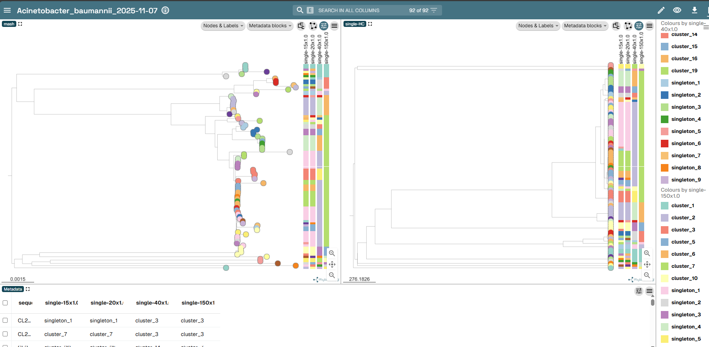
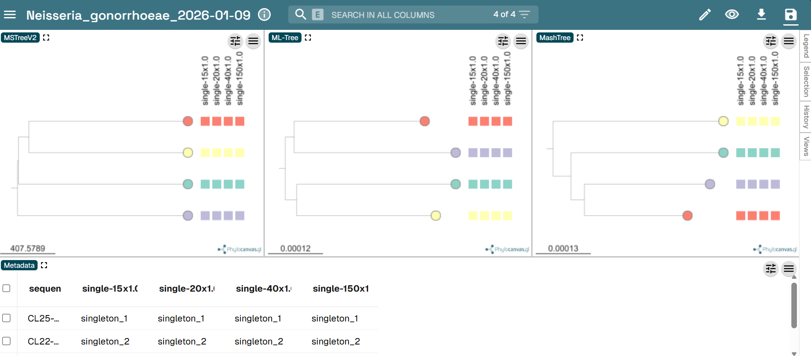

# 📂 Pipeline Outputs

This document describes the outputs generated by **CorGe+**.

All paths described below are relative to the pipeline output directory specified with:

```
--outdir
```

---

# 📊 Output Directory Structure

Results are organized by **species**:

<details>
<summary>cgMLST schema provided</summary>

```
     📁 corge_results
      ├── 📁 pipeline_info
      │    ├── 📄 execution_report_<date-hour>.html (one per batch)
      │    ├── 📄 execution_timeline_<date-hour>.html (one per batch)
      │    ├── 📄 execution_trace_<date-hour>.txt (one per batch)
      │    ├── 📄 software_versions.yml
      │    └── 📄 samplesheet.valid.csv
      └── 📁 <Species>
            ├── 📁 assemblies
            │    └── 📄 <sample>.fasta (one Fasta per sample)
            ├── 📁 cgMLST
            │   ├── 📁 joined
            │   │   └── 📄 <Species>_joined_results_alleles.tsv
            │   ├── 📁 masked
            │   │    ├── 📄 <Species>_Presence_Abscence.tsv
            │   |    ├── 📄 <Species>_masked_results_alleles.tsv
            │   |    ├── 📄 <Species>_cgMLSTschema0.txt
            │   |    └── 📄 <Species>_cgMLST.html
            │   ├── 📁 msa (only if --tree is used)
            │   │    ├── 📄 <Species>_dna_msa_variable.fasta
            │   |    ├── 📄 <Species>_dna_msa.fasta
            │   |    ├── 📄 <Species>_protein_msa_variable.fasta
            │   |    ├── 📄 <Species>_protein_msa.fasta
            │   |    └── 📄 <Species>_protein_summary_stats.tsv
            │   └── 📁 new
            │       ├── 📄 <Species>_new_cds_coordinates.tsv
            │       ├── 📄 <Species>_new_invalid_cds.txt
            │       ├── 📄 <Species>_new_loci_summary_stats.tsv
            │       ├── 📄 <Species>_new_logging_info.txt
            │       ├── 📄 <Species>_new_paralogous_loci.tsv
            │       ├── 📄 <Species>_new_results_alleles.tsv
            │       ├── 📄 <Species>_new_results_contigsInfo.tsv
            │       └── 📄 <Species>_new_results_statistics.tsv
            ├── 📁 linkages
            │   └── 📄 <Species>_potential_linkages.csv
            ├── 📁 genomic_context_groups
            │   └── 📄 <Species>-groups_HC<threshold>.csv (one per threshold)
            ├── 📁 mashtree
            │   ├── 📄 <Species>_mash.dist
            │   ├── 📄 <Species>_mash.dnd
            │   └── 📄 <Species>_mash_rooted.tre
            ├── 📁 metadata
            │   └── 📄 <Species>_metadata.tsv (curated metadata if provided)
            ├── 📁 microreact
            │   └── 📄 <Species>_corge.microreact
            ├── 📁 poodle_samplesheets
            │   └── 📄 <Species>_poodle_manifest_HC<threshold>.csv (one per threshold)
            ├── 📁 ReporTree
            │    ├── 📄 <Species>_clusterComposition.tsv
            │    ├── 📄 <Species>_dist_hamming.tsv
            │    ├── 📄 <Species>_flt_samples_matrix.tsv
            │    ├── 📄 <Species>_loci_report.tsv
            │    ├── 📄 <Species>_nomenclature_changes.tsv
            │    ├── 📄 <Species>_partitions.tsv
            │    ├── 📄 <Species>_single_HC.nwk
            │    └── 📄 <Species>.log
            └── 📁 tree (only if --tree is used)
                ├── 📄 <Species>_constant-sites.txt
                ├── 📄 <Species>_rooted_cgmlst_snp.tree
                ├── 📄 <Species>.iqtree
                └── 📄 <Species>.nwk
```

</details>

<details>
<summary>No cgMLST schema provided (Parsnp)</summary>

```
     📁 corge_results
      ├── 📁 pipeline_info
      │    ├── 📄 execution_report_<date-hour>.html (one per batch)
      │    ├── 📄 execution_timeline_<date-hour>.html (one per batch)
      │    ├── 📄 execution_trace_<date-hour>.txt (one per batch)
      │    ├── 📄 software_versions.yml
      │    └── 📄 samplesheet.valid.csv
      └── 📁 <Species>
            ├── 📁 assemblies
            │    └── 📄 <sample>.fasta (one Fasta per sample)
            ├── 📁 parsnp
            │   ├── 📄 <Species>_core_msa.fasta (only if --tree is used)
            │   ├── 📄 <Species>_parsnp.ggr
            │   ├── 📄 <Species>_parsnp.maf
            │   ├── 📄 <Species>_parsnp.rec
            │   ├── 📄 <Species>_parsnp.snps.mblocks
            │   ├── 📄 <Species>_parsnp.xmfa
            │   ├── 📄 <Species>_parsnpAligner.ini
            │   ├── 📄 <Species>_parsnpAligner.log
            │   └── 📄 <Species>_snps_alignment.fasta
            ├── 📁 linkages
            │   └── 📄 <Species>_potential_linkages.csv
            ├── 📁 genomic_context_groups
            │   └── 📄 <Species>-groups_HC<threshold>.csv (one per threshold)
            ├── 📁 metadata
            │   └── 📄 <Species>_metadata.tsv (curated metadata if provided)
            ├── 📁 mashtree
            │   ├── 📄 <Species>_mash.dist
            │   ├── 📄 <Species>_mash.dnd
            │   └── 📄 <Species>_mash_rooted.tre
            ├── 📁 microreact
            │   └── 📄 <Species>_corge.microreact
            ├── 📁 poodle_samplesheets
            │   └── 📄 <Species>_poodle_manifest_HC<threshold>.csv (one per threshold)
            ├── 📁 ReporTree
            │    ├── 📄 <Species>_clusterComposition.tsv
            │    ├── 📄 <Species>_dist_hamming.tsv
            │    ├── 📄 <Species>_flt_samples_matrix.tsv
            │    ├── 📄 <Species>_loci_report.tsv
            │    ├── 📄 <Species>_nomenclature_changes.tsv
            │    ├── 📄 <Species>_partitions.tsv
            │    ├── 📄 <Species>_single_HC.nwk
            │    └── 📄 <Species>.log
            └── 📁 tree (only if --tree is used)
                ├── 📄 <Species>_constant-sites.txt
                ├── 📄 <Species>_rooted_parsnp.tree
                ├── 📄 <Species>.iqtree
                └── 📄 <Species>.nwk
```

</details>

---


# 🔑 Key Output Files

CorGe+ generates outputs to support surveillance, cluster interpretation, and downstream hqSNP-based analysis.

---

## 📘 Potential linkages

**File:**

```
linkages/<Species>_potential_linkages.csv
```

Summarizes genome completeness and identifies related samples based on **allelic (cgMLST)** or **SNP distances (Parsnp)**.

### Columns

| Column                  | Description                                   |
| ----------------------- | --------------------------------------------- |
| `sample`                | Sample identifier                             |
| `species`               | Species name                                  |
| `percentage_called`     | Proportion of genome/schema recovered (0–1)   |
| `completeness_qc`       | Quality flag based on completeness            |
| `min_dist`              | Minimum genetic distance to another sample    |
| `strong_linkages`       | Closely related samples (0–10 distance)       |
| `intermediate_linkages` | Moderate links (11–40 distance)               |
| `lineage_level`         | Distant but related samples (41–150 distance) |

### Completeness QC thresholds

| Status | Completeness |
| ------ | ------------ |
| PASS   | ≥ 95%        |
| WARN   | 90–94.9%     |
| FAIL   | < 90%        |

> ⚠ **Low completeness may indicate:**
>
> * incomplete or poor-quality assemblies
> * contamination or misassembly
> * incorrect species assignment

Example:

```csv
sample,species,percentage_called,completeness_qc,min_dist,strong_linkages,intermediate_linkages,lineage_level
sample1,Escherichia_coli,0.9697572622363708,PASS,0,"sample2 (0), sample3 (1)",None,None
sample2,Escherichia_coli,0.9693593314763232,PASS,0,"sample1 (0), sample3 (1)",None,None
sample3,Escherichia_coli,0.9701551929964186,PASS,1,"sample1 (1), sample2 (1)",None,None
```

>[!IMPORTANT]
> Linkages involving samples flagged as **FAIL** should be interpreted with caution. We recommend re-sequencing or confirming relatedness using **read-based analyses** with samples at the **lineage level** to avoid missing potential links. Completeness of cgMLST schemes has been highlighted as crucial to ensure correct clustering [Merda et. al, 2024](https://link.springer.com/article/10.1186/s12864-024-10982-z).

---

## 📗 Genomic context groups

**Files:**

```
genomic_context_groups/<Species>-groups_HC<threshold>.csv
```

Defines groups of related samples at each clustering threshold.

### Columns

| Column          | Description                     |
| --------------- | ------------------------------- |
| `sample`        | Sample identifier               |
| `species`       | Species name                    |
| `group_name`    | Cluster ID (e.g. `HC20-C5`)     |
| `group_length`  | Number of samples in the group  |
| `group_samples` | Comma-separated list of samples |
| `report_date`   | Analysis timestamp              |


Example:

```csv
sample,species,group_name,group_length,group_samples,report_date
sample1,Escherichia_coli,HC1-C1,3,"sample1,sample2,sample3",2026-04-01
sample2,Escherichia_coli,HC1-C1,3,"sample1,sample2,sample3",2026-04-01
sample3,Escherichia_coli,HC1-C1,3,"sample1,sample2,sample3",2026-04-01
```

> [!NOTE]
> Groups are labeled using the standardized format `HC<partition>-C<id>` (e.g. `HC20-C25`):
>
> * `HC<partition>`: the lowest distance at which all samples in the group cluster together at a given distance threshold (single-linkage)
> * `C<id>`: unique cluster identifier within that level
>
> Group names remain **stable across runs**, as CorGe+ reuses previous clustering results (`partitions.csv`).

---

## 📝 PoODLE samplesheets


**Files:**

```
poodle_samplesheets/<Species>_HC<threshold>_poodle_manifest.csv
```


[**PoODLE**](https://github.com/MDHHS-Bioinformatics/poodle) is a bioinformatics pipeline for high-resolution analysis of bacterial groups, combining hqSNP calling ([`Snippy`](https://github.com/tseemann/snippy)), recombination filtering ([`Gubbins`](https://github.com/nickjcroucher/gubbins)), phylogenetics ([`IQ-TREE`](https://iqtree.github.io/)), pangenome analysis ([`Panaroo`](https://github.com/gtonkinhill/panaroo)), and Mash distance estimation ([`MashTree`](https://github.com/lskatz/mashtree)). It produces an interactive HTML report for each cluster with trees, pangenome profile, and distance matrices.

CorGe+ automatically generates a PoODLE-compatible manifest for every selected threshold. The required columns are:

```csv
sample,fastq_1,fastq_2,annotation,assembly,cluster_id,species,reference
```
The FASTQ and annotation (GFF) fields are left empty by default, but CorGe+ can fill them automatically if you provide a [PHoeNIx](https://github.com/CDCgov/phoenix) results directory (`--phoenix_path`), a [Bactopia](https://bactopia.github.io/latest/) results directory (`--bactopia_path`), or a CSV with paths via `--master_paths`.

For each cluster, CorGe+ selects a reference genome based on the highest core-genome completeness, followed by the "best" assembly quality (fewest contigs, longest length, and alphabetical tie-break).


## 🧬 Microreact visualization

**File:**

```
microreact/<Species>_corge.microreact
```

CorGe+ generates a `.microreact` file that brings together **complementary genetic perspectives**:

* **Mashtree** - produces a k-mer–based distance tree that reflects overall genome composition, including accessory genes.
* **Core-genome distance tree** - prepared by ReporTree with the MSTreeV2 method, its useful for visualizing genetic relatedness among isolates.
* **Maximum-Likelihood tree** - phylogenetic tree based on DNA sequence alignment, included when `--tree` is used.

To aid interpretation, Microreact also displays **metadata blocks per threshold**, using the ReporTree **partition nomenclature**.
Each partition corresponds to a hierarchical clustering level and includes the method, numeric threshold, and distance unit. For example, threshold **15** corresponds to the partition `single-15x1.0`.

Upload to: [https://microreact.org/upload](https://microreact.org/upload)

_Microreact example using default settings_
### 

_Microreact example using the `--tree` option_
### 

> [!TIP]  
> You can also explore groups interactively by uploading the ReporTree files `.nwk` and `metadata_w_partitions.tsv` or `partitions.tsv` to [`GrapeTree`](https://github.com/achtman-lab/GrapeTree), [`SPREAD`](https://github.com/genpat-it/spread) or [`Auspice`](https://auspice.us/). These tools run entirely in your browser for quick and private visualization.


---

# 🧬 Tool-Specific Outputs

Detailed tool outputs are stored in subdirectories.


## ChewBBACA

Directory:

```
cgMLST/
```

<details>
<summary>Files</summary>

**Subdirectories:**

| Folder    | Description                                        |
| --------- | -------------------------------------------------- |
| `new/`    | Results for the latest batch (allele calling). More details: [AlleleCall](https://chewbbaca.readthedocs.io/en/latest/user/modules/AlleleCall.html)    |
| `joined/` | Combined profiles (new + previous runs).  More details: [JoinProfile](https://chewbbaca.readthedocs.io/en/latest/user/modules/JoinProfiles.html)            |
| `masked/` | cgMLST profiles with invalid and inferred alleles masked (new + previous runs). [ExtractCgMLST](https://chewbbaca.readthedocs.io/en/latest/user/modules/ExtractCgMLST.html)     |
| `msa/`    | Multiple sequence alignments (if `--tree` is used). [ComputeMSA](https://chewbbaca.readthedocs.io/en/latest/user/modules/ComputeMSA.html#outputs) |

---

**Files**

| File                                          | Description                                |
| --------------------------------------------- | ------------------------------------------ |
| `joined/<Species>_joined_results_alleles.tsv` | Combined allele profiles across all runs   |
| `masked/<Species>_cgMLST.html`                | cgMLST summary report                      |
| `masked/<Species>_cgMLSTschema0.txt`          | List of loci used              |
| `masked/<Species>_masked_results_alleles.tsv` | Masked allele profiles |
| `masked/<Species>_missing_loci_stats.tsv`     | Total number and percentage of loci missing from each genome |
| `masked/<Species>_presence_abscence.tsv`      | Locus presence/absence matrix              |
| `new/<Species>_new_cds_coordinates.tsv`     | Coordinates of predicted coding sequences (CDSs) per genome |
| `new/<Species>_new_invalid_cds.txt`         | CDSs excluded due to size or ambiguous bases                |
| `new/<Species>_new_loci_summary_stats.tsv`  | Classification counts per locus                             |
| `new/<Species>_new_logging_info.txt`        | Execution log and run details                               |
| `new/<Species>_new_paralogous_counts.tsv`   | Counts of paralogous loci per genome                        |
| `new/<Species>_new_paralogous_loci.tsv`     | List of detected paralogous loci                            |
| `new/<Species>_new_results_alleles.tsv`     | Allele calls for all loci and samples                       |
| `new/<Species>_new_results_contigsInfo.tsv` | Contig-level statistics per genome                          |
| `new/<Species>_new_results_statistics.tsv`  | Classification summary per genome                           |

### 💡 Notes

* Classification types include: `EXC`, `INF`, `PLOT3`, `PLOT5`, `LOTSC`, `NIPH`, `NIPHEM`, `ALM`, `ASM`, `PAMA`, `LNF`
* CDSs are predicted using **Prodigal** and filtered before allele calling


**MSA outputs (optional, `--tree`)**

| File                                      | Description              |
| ----------------------------------------- | ------------------------ |
| `msa/<Species>_dna_msa_variable.fasta`    | Variable nucleotide sites alignment |
| `msa/<Species>_dna_msa.fasta`             | Full DNA alignment       |
| `msa/<Species>_protein_msa_variable.fasta` | Variable aminoacid sites alignment |
| `msa/<Species>_protein_msa.fasta`         | Protein alignment        |
| `msa/<Species>_summary_stats.tsv`         | Alignment statistics     |

</details>


---

## Parsnp

Directory:

```
parsnp/
```

<details>
<summary>Files</summary>

| File | Description |
|------|-------------|
| `<Species>_core_msa.fasta` | **Multiple-sequence alignment** — alignment of core-genome regions in FASTA format (only when `--tree` is used) |
| `<Species>_parsnp.ggr` | **Genome Graph Representation** — a binary file used internally by Parsnp to represent the alignment graph. |
| `<Species>_parsnp.maf` | **Multiple Alignment Format (MAF)** — contains the core-genome alignment across all input genomes. |
| `<Species>_parsnp.rec` | **Recombination Regions** — lists regions identified as recombinant and excluded from SNP analysis |
| `<Species>_parsnp.snps.mblocks` | **SNP Blocks** — lists SNPs grouped into blocks, useful for downstream phylogenetic analysis. |
| `<Species>_parsnp.xmfa` | **Extended Multi-FASTA Alignment (XMFA)** — alignment of core-genome regions in XMFA format, compatible with tools like Mauve. |
| `<Species>_parsnpAligner.ini` | **Configuration File** — records the parameters and settings used during the Parsnp run. |
| `<Species>_parsnpAligner.log` | **Log File** — detailed log of the Parsnp execution, including progress and any warnings or errors. |
| `<Species>_snps_alignment.fasta` | **SNP Alignment** — FASTA file containing the core-genome SNP alignment with reference and assembly extensions removed, used for ReporTree. | |

</details>

---

## ReporTree

Directory:

```
ReporTree/
```

<details>
<summary>Files</summary>

| File                                 | Description                                |
| ------------------------------------ | ------------------------------------------ |
| `<Species>_clusterComposition.tsv`   | Cluster composition summary                 |
| `<Species>_dist_hamming.tsv`         | Pairwise distance matrix                   |
| `<Species>_flt_samples_matrix.tsv`   | Filtered allele/SNP matrix                 |
| `<Species>_loci_report.tsv`          | Loci statistics                            |
| `<Species>_partitions.tsv`           | Clustering partitions (used for group assignations) |
| `<Species>_nomenclature_changes.tsv` | Cluster name updates across runs           |
| `<Species>_single_HC.nwk`            | Hierarchical clustering tree               |
| `<Species>.log`                      | Execution log                              |

Details at [ReporTree-Main-Outputs](https://github.com/insapathogenomics/ReporTree/wiki/2.-Input-Output#main-output-files)

</details>

---

## MashTree

Directory:

```
mashtree/
```

<details>
<summary>Files</summary>

| File                         | Description                  |
| ---------------------------- | ---------------------------- |
| `<Species>_<cluster_id>.dnd` | Mash-based distance tree |
| `<Species>_<cluster_id>_rooted_mash.tre` | Mash-based distance tree midpoint rooted |
| `<Species>_<cluster_id>.tsv` | Mash distance matrix         |

</details>

---

## Tree

Directory:

```
tree/   (only if --tree is used)
```

<details>
<summary>Files</summary>

| File                           | Description                             |
| ------------------------------ | --------------------------------------- |
| `<Species>_constant-sites.txt` | Constant sites used for tree correction |
| `<Species>_rooted_parsnp.tree` | Midpoint rooted tree (Parsnp-based)              |
| `<Species>_rooted_cgmlst_snp.tree` | Midpoint rooted tree (cgMLST-based)              |
| `<Species>.iqtree`             | IQ-TREE report (model + statistics)     |
| `<Species>.nwk`                | Maximum-likelihood phylogenetic tree (unrooted)   |

</details>

---

### Metadata
A filtered .tsv file is produced per species if the `--metadata` file is provided.


# 🧾 Pipeline Execution Information

Directory:

```
pipeline_info/
```

This directory contains Nextflow execution reports.

<details>
<summary>Files</summary>

| File                      | Description                |
| ------------------------- | -------------------------- |
| `execution_report.html`   | Pipeline execution summary |
| `execution_timeline.html` | Task timeline              |
| `execution_trace.txt`     | Detailed resource usage    |
| `pipeline_dag.svg`        | Workflow graph             |
| `software_versions.yml`   | Software versions used     |

</details>

These files are useful for **reproducibility and troubleshooting**.

