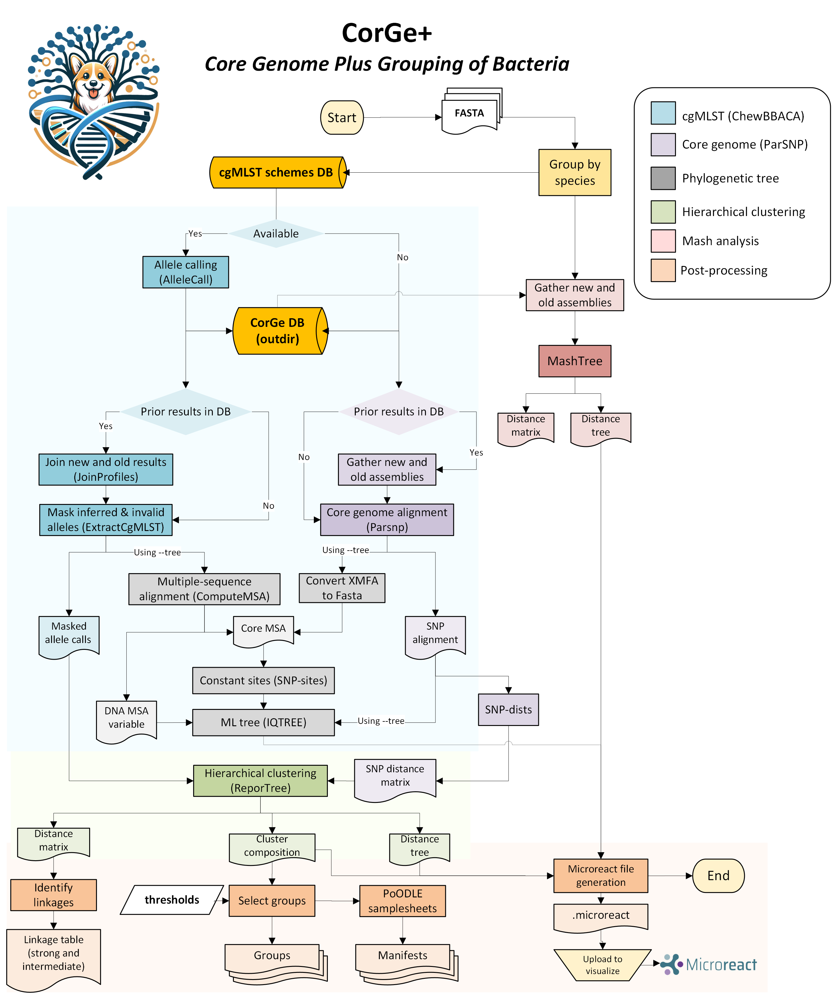

# 🧬 Pipeline Workflow

This document describes the analytical workflow implemented in **CorGe+**.

The pipeline processes sequencing data using a series of modular steps implemented in **Nextflow DSL2**. Each step is executed independently and automatically parallelized when possible.

---

# 📊 Workflow Overview

The workflow consists of several stages that transform raw sequencing data into interpretable results for genomic surveillance.

### 

---

# 🔬 Pipeline Stages

1. Verify cgMLST schema availability for each species.
2. Perform core genome analysis using [`ChewBBACA`](https://github.com/B-UMMI/chewBBACA) (cgMLST) or [`Parsnp`](https://github.com/marbl/parsnp) (core alignment if schema unavailable).
3. Generate a phylogenetic tree with [`IQ-TREE`](https://www.iqtree.org/) (optional with `--tree`).
4. Hierarchical clustering with [`ReporTree`](https://github.com/insapathogenomics/ReporTree).
5. Create potential linkage tables per species.
6. Select groups per sample using user-defined thresholds.
7. Generate [`PoODLE`](https://github.com/MDHHS-Bioinformatics/poodle) manifests.
8. Run [`MashTree`](https://github.com/lskatz/mashtree).
9. Generate [`Microreact`](https://microreact.org/) files for visual exploration of genomic groups in trees.
